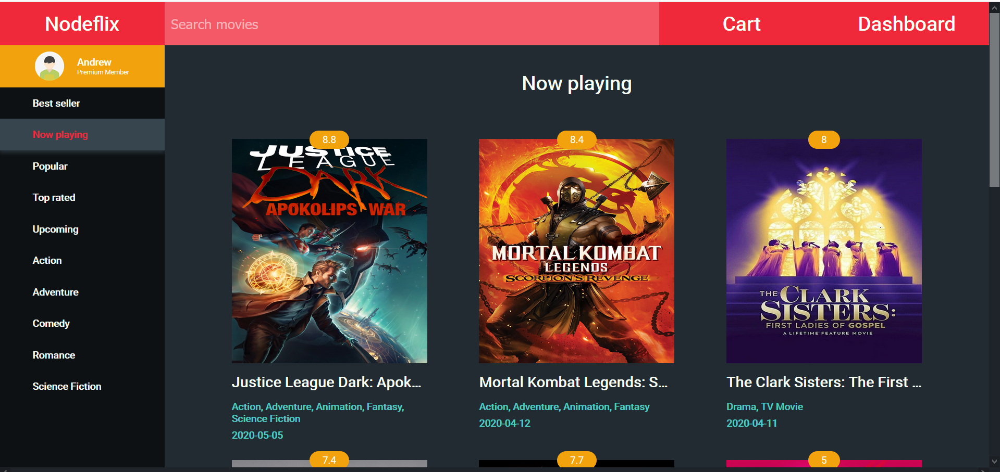
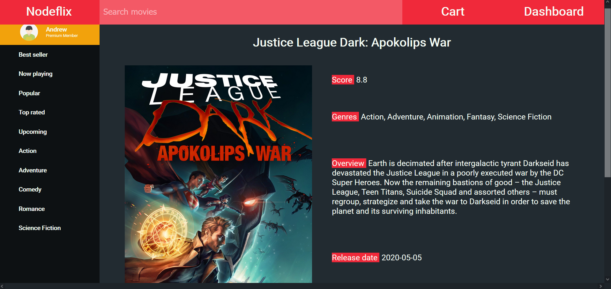
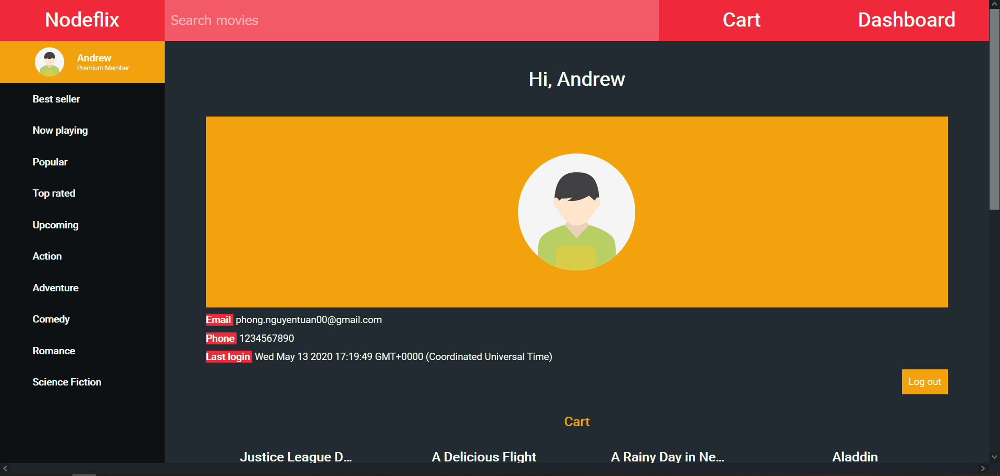
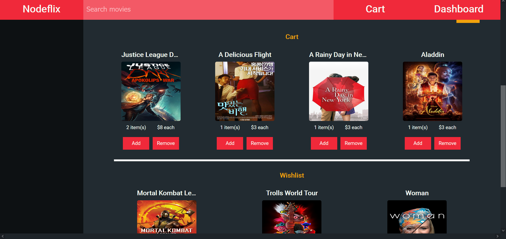
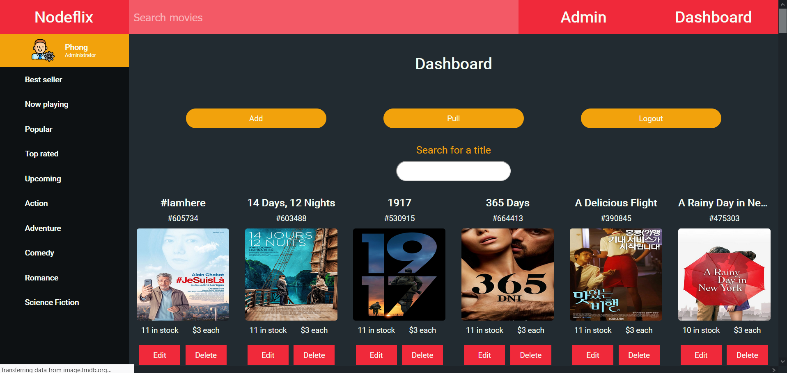
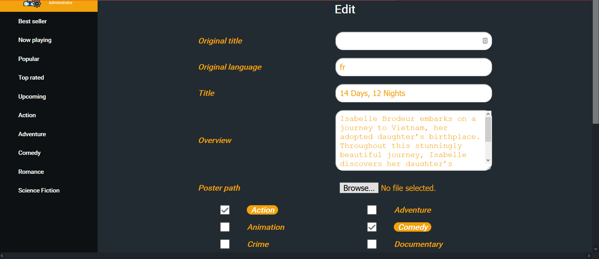
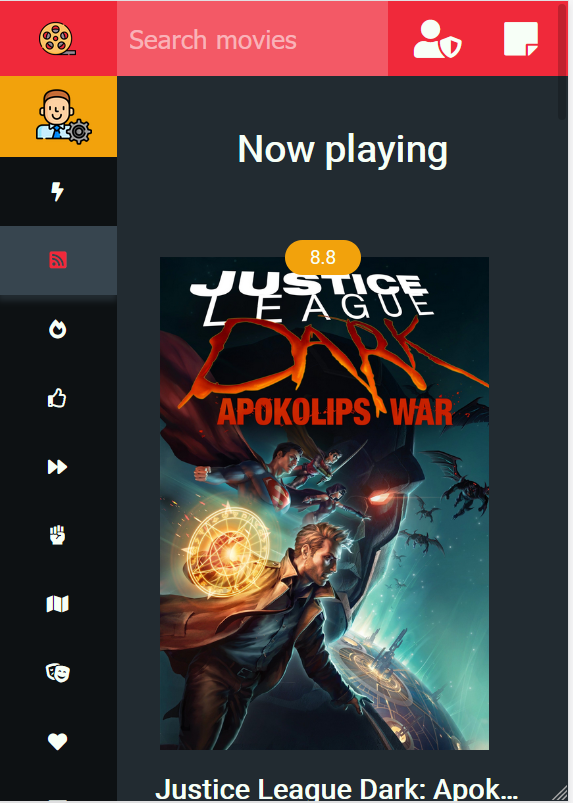

# Nodeflix :cd:
Special thanks to [TheMovieDB](https://developers.themoviedb.org/3) for their amazing API.

Project is hosted on Heroku at https://nodeflix.herokuapp.com/

**Dummy Admin**

phongnguyentuan20@gmail.com

Abcd@1234

**Dummy User**

phong.nguyentuan00@gmail.com

Abcd@1234

## Libraries & Frameworks

`express.js`

`express-handlebars`

`mongoose`

`@hapi/joi`,`jsonwebtoken`, `bcrypt`, `cookie-parser`, `moment.js`, `dot.env`, ...

## Nodeflix

### Features

User

- Fetching the latest movies' info
- Search for a movie title
- Signing in to buy a movie or add to wish list
- Receiving confirmation e-mail after each successful order
- Friendly UI on all your devices

Admin

- Unlock protected routes
- A new distinguished UI for adding, editing and deleting moving

### Screenshot

